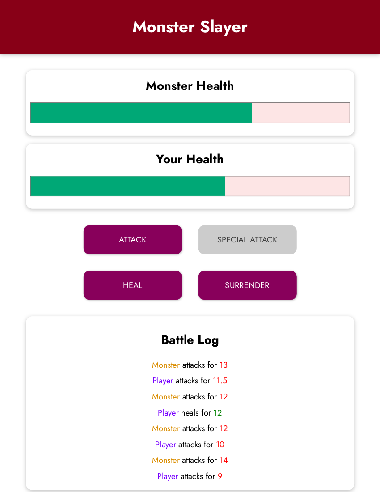

## Monster Slayer

"Monster Slayer" is a simple web-based game where the player battles against a monster. The goal is to defeat the monster while managing the player's health and using various attack and healing options strategically. This project was built using the Vue.js framework as a part of Maximilian Schwarzmüller's course.

### Demo

Check it out live: [Monster Slayer](https://endearing-speculoos-36e30b.netlify.app)

### Gameplay
The game starts with both the player and the monster having 100 health points each. You can use the following buttons to interact with the game:
- **ATTACK**: This button initiates a regular attack on the monster, dealing damage between a minimum and maximum value.
- **SPECIAL ATTACK**: This button executes a more powerful attack, causing greater damage than a regular attack, but it can only be used every 3rd round.
- **HEAL**: This button allows the player to heal themselves, adding health points within a certain range.
- **SURRENDER**: This button allows the player to surrender the game, resulting in an immediate victory for the monster.

The game progresses in rounds, and each time you attack or heal, the monster will counter-attack. If either the player's or monster's health reaches zero or below, the game ends, and the winner is declared. A "Game Over" section will display the result of the game, and players have the option to start a new game.

